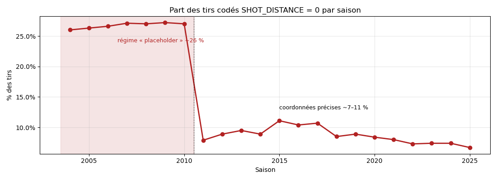
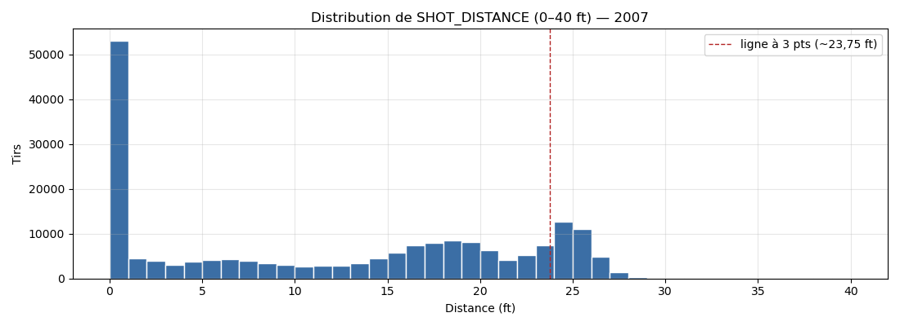
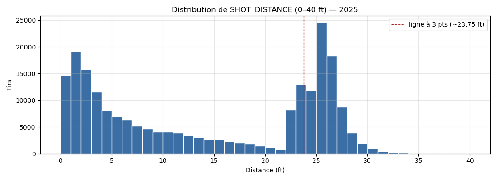

**COLONNES**

## Description des variables

| N° | Nom de la colonne | Description | Dispo. a priori | Type | Taux de NA | Gestion des NA | Distribution des valeurs | Remarques |
|:---:|:---|:---|:---|:---|:---:|:---|:---|:---|
| 1 | `SEASON_1` | Année de fin de saison (2004 = saison 2003‑04) | Oui | int64 | 0 % | — | 22 modalités, 2004→2025 ; ~150 k–220 k lignes/saison | Redondant avec `SEASON_2`. Garder comme feature « effet époque ». |
| 2 | `SEASON_2` | Libellé de saison `AAAA-AA` | Oui | object | 0 % | — | 22 modalités, `2003-04`→`2024-25` | **Redondant** avec `SEASON_1` → à supprimer. |
| 3 | `TEAM_ID` | Identifiant de la franchise du tireur | Oui | int64 | 0 % | — | 30 modalités | Clé stable de la franchise. |
| 4 | `TEAM_NAME` | Nom de la franchise du tireur | Oui | object | 0 % | — | **36 modalités pour 30 `TEAM_ID`** | Renommages/relocations (Seattle→OKC, NJ→Brooklyn, Bobcats→Hornets, NO Hornets→Pelicans). Se rattacher à `TEAM_ID`. |
| 5 | `PLAYER_ID` | Identifiant du tireur | Oui | int64 | 0 % | — | 2 265 modalités | Clé joueur fiable. |
| 6 | `PLAYER_NAME` | Nom du tireur | Oui | object | 0 % | — | **2 286 modalités > 2 265 `PLAYER_ID`** | Variantes d'orthographe (accents, « Jr. »). Se rattacher à `PLAYER_ID`. |
| 7 | `POSITION_GROUP` | Poste agrégé : Guard / Forward / Center | Oui | object | **4,9 % `NULL` + 0,2 % `"NA"`** | Imputer via `PLAYER_ID` (saisons antérieures) ; sinon `"Unknown"` | `G` 42,9 % · `F` 36,8 % · `C` 15,2 % · `NULL` 4,9 % (⇒ **100 % de la saison 2024‑25**) · `"NA"` 0,2 % | NA **non aléatoires** : concentrés sur la dernière saison. |
| 8 | `POSITION` | Poste détaillé (PG, SG, SF, PF, C + combinés type `SG-PG`) | Oui | object | **4,9 % `NULL` + 0,2 % `"NA"`** | idem `POSITION_GROUP` | 18 modalités ; top : `SG` 22 % · `PG` 20 % · `PF` 19 % · `SF` 17 % · `C` 15 % | Fortement cardinalisé par les combos ; regrouper vers `POSITION_GROUP`. |
| 9 | `GAME_DATE` | Date du match | Oui | object (`MM-DD-YYYY`) | 0 % | — | 3 517 dates distinctes ; chaque saison ≈ fin oct. → mi‑avril | **Texte** → `pd.to_datetime(format="%m-%d-%Y")`. Absence de dates de playoffs = confirme périmètre saison régulière. |
| 10 | `GAME_ID` | Identifiant du match | Oui | int64 | 0 % | — | 26 453 modalités | ~1 230 matchs/saison (82 × 30 / 2), sauf saisons écourtées. |
| 11 | `HOME_TEAM` | Abréviation de l'équipe à domicile | Oui | object | 0 % | — | **34 modalités** | Abréviations non stables dans le temps (relocations). |
| 12 | `AWAY_TEAM` | Abréviation de l'équipe à l'extérieur | Oui | object | 0 % | — | **34 modalités** | Idem. Croiser avec `TEAM_NAME`/`TEAM_ID` pour dériver « tireur à domicile ». |
| 13 | `EVENT_TYPE` | `Made Shot` / `Missed Shot` | **Non (fuite)** | object | 0 % | — | `Missed` 54,2 % · `Made` 45,8 % | **Strictement équivalent à `SHOT_MADE`** (0 incohérence / 4,45 M) → supprimer. |
| 14 | `SHOT_MADE` | Tir réussi (booléen) — **variable cible** | **Non (cible)** | bool | 0 % | — | `True` 45,8 % · `False` 54,2 % | Cible du modèle. Classes quasi équilibrées. |
| 15 | `ACTION_TYPE` | Geste technique (Jump Shot, Driving Layup, Dunk…) | Oui | object | 0 % | — | **70 modalités**, très déséquilibrées : `Jump Shot` majoritaire, puis `Layup Shot`, `Driving Layup Shot`, `Pullup Jump Shot`, `Dunk Shot`… longue traîne de gestes rares | Très informatif mais forte cardinalité → regrouper (jump / layup / dunk / tip / hook / floater). |
| 16 | `SHOT_TYPE` | `2PT Field Goal` / `3PT Field Goal` | Oui | object | 0 % | — | `2PT` 70,8 % · `3PT` 29,2 % | Déductible des zones « 3 » et de la distance → redondant partiel. |
| 17 | `BASIC_ZONE` | Zone de tir (7) : Restricted Area, In The Paint (Non‑RA), Mid‑Range, Above the Break 3, Left/Right Corner 3, Backcourt | Oui | object | 0 % | — | `Restricted Area` 31,6 % · `Mid‑Range` 23,8 % · `Above the Break 3` 21,5 % · `Paint Non‑RA` 15,5 % · `L Corner 3` 3,9 % · `R Corner 3` 3,6 % · `Backcourt` 0,2 % | Bon compromis granularité/lisibilité pour la dataviz. |
| 18 | `ZONE_NAME` | Latéralité (6) : Center, Left/Right Side, Left/Right Side Center, Back Court | Oui | object | 0 % | — | `Center` 54,3 % · `L/R Side Center` ~11,8 % · `L/R Side` ~11 % · `Back Court` 0,2 % | 1:1 avec `ZONE_ABB`. |
| 19 | `ZONE_ABB` | Code latéralité : `C`, `LC`, `RC`, `L`, `R`, `BC` | Oui | object | 0 % | — | idem `ZONE_NAME` | **Redondant** avec `ZONE_NAME` → garder une seule. |
| 20 | `ZONE_RANGE` | Tranche de distance (5) : `Less Than 8 ft.`, `8-16 ft.`, `16-24 ft.`, `24+ ft.`, `Back Court Shot` | Oui | object | 0 % | — | `<8 ft` 41,0 % · `24+ ft` 28,9 % · `16‑24 ft` 15,6 % · `8‑16 ft` 14,2 % · `Back Court` 0,2 % | Discrétisation de `SHOT_DISTANCE`. |
| 21 | `LOC_X` | Coordonnée latérale (ft), 0 = axe du panier | Oui | float64 | 0 % | Voir §rupture de collecte | min −25 · max 25 · symétrique autour de 0 | 951 valeurs distinctes (arrondi 0,05). **Imputé à 0 pour les tirs au cercle des saisons ≤ 2010.** |
| 22 | `LOC_Y` | Coordonnée longitudinale (ft), 0 = ligne de fond, panier ≈ 5,25 | Oui | float64 | 0 % | Voir §rupture de collecte | min 0,05 · max 93,65 (heaves plein terrain) | 1 696 valeurs distinctes. **Imputé à ~5,25 pour les tirs au cercle des saisons ≤ 2010.** |
| 23 | `SHOT_DISTANCE` | Distance du tir au panier (ft, entier) | Oui | int64 | 0 % | Voir §rupture de collecte | min 0 · max 89 · moy 12,63 · méd 13 · σ 10,16 · **distribution bimodale** | **`= 0` sur 14,2 % des lignes** ; part passant de ~26 % (≤ 2010) à ~8 % (≥ 2011) → **non comparable dans le temps**. |
| 24 | `QUARTER` | Quart‑temps ; 5‑8 = prolongations | Oui | int64 | 0 % | — | `1` 26,1 % · `2` 25,0 % · `3` 24,6 % · `4` 23,7 % · `5‑8` (OT) 0,7 % | Cohérent. |
| 25 | `MINS_LEFT` | Minutes restantes dans le quart‑temps | Oui | int64 | 0 % | — | 0 → 12 | Combiner avec `SECS_LEFT` → `temps_restant_s = MINS_LEFT*60 + SECS_LEFT`. |
| 26 | `SECS_LEFT` | Secondes restantes dans la minute courante | Oui | int64 | 0 % | — | 0 → 59 | idem. |

---

## Chiffres clés

| Indicateur | Valeur |
|---|---|
| **Nombre de lignes (total 22 saisons)** | **4 450 789** |
| Nombre de colonnes | 26 |
| Matchs distincts (`GAME_ID`) | 26 453 |
| Joueurs distincts (`PLAYER_ID`) | 2 265 |
| Équipes distinctes (`TEAM_ID`) | 30 |
| Taux de réussite global (`SHOT_MADE`) | 45,8 % |
| Part de tirs à 3 points | 29,2 % (18,7 % en 2003‑04 → 42,1 % en 2024‑25) |
| Lignes en double (exactes) | 398 (0,009 %) |
| Cellules manquantes | `POSITION` / `POSITION_GROUP` uniquement — 219 527 `NULL` (toute la saison 2024‑25) + ~7 930 littéraux `"NA"` |

---

## Redondance

---
| Redondance | Détail | Action étape 2 |
|---|---|---|
| `EVENT_TYPE` ↔ `SHOT_MADE` | **0 incohérence** sur 4,45 M lignes → strictement équivalents | garder `SHOT_MADE`, supprimer `EVENT_TYPE` |
| `ZONE_NAME` ↔ `ZONE_ABB` | correspondance 1:1 (autant de paires que de modalités) | garder une seule |
| `SEASON_1` ↔ `SEASON_2` | même info, formats différents | garder `SEASON_1` (int) |
| `BASIC_ZONE` / `ZONE_RANGE` / `ZONE_NAME` | hiérarchie spatiale corrélée à `LOC_X/Y` et `SHOT_DISTANCE` | choisir *soit* les zones *soit* les coordonnées |
| `SHOT_TYPE` | déductible des zones « 3 » et de la distance | redondant partiel |
---

## Valeurs manquantes

<table border="1" class="dataframe">
  <thead>
    <tr style="text-align: right;">
      <th></th>
      <th>n_null</th>
      <th>n_literal_NA</th>
      <th>taux_%</th>
    </tr>
  </thead>
  <tbody>
    <tr>
      <th>POSITION_GROUP</th>
      <td>219527.0</td>
      <td>7930.0</td>
      <td>5.11</td>
    </tr>
    <tr>
      <th>POSITION</th>
      <td>219527.0</td>
      <td>7930.0</td>
      <td>5.11</td>
    </tr>
  </tbody>
</table>

<table border="1" class="dataframe">
  <thead>
    <tr style="text-align: right;">
      <th></th>
      <th>SEASON_2</th>
      <th>n_tirs</th>
      <th>pos_null</th>
      <th>pos_literal_na</th>
    </tr>
  </thead>
  <tbody>
    <tr>
      <th>0</th>
      <td>2003-04</td>
      <td>189803</td>
      <td>0.0</td>
      <td>0.0</td>
    </tr>
    <tr>
      <th>1</th>
      <td>2004-05</td>
      <td>197626</td>
      <td>0.0</td>
      <td>0.0</td>
    </tr>
    <tr>
      <th>2</th>
      <td>2005-06</td>
      <td>194314</td>
      <td>0.0</td>
      <td>0.0</td>
    </tr>
    <tr>
      <th>3</th>
      <td>2006-07</td>
      <td>196072</td>
      <td>0.0</td>
      <td>0.0</td>
    </tr>
    <tr>
      <th>4</th>
      <td>2007-08</td>
      <td>200501</td>
      <td>0.0</td>
      <td>0.0</td>
    </tr>
    <tr>
      <th>5</th>
      <td>2008-09</td>
      <td>199030</td>
      <td>0.0</td>
      <td>0.0</td>
    </tr>
    <tr>
      <th>6</th>
      <td>2009-10</td>
      <td>200966</td>
      <td>0.0</td>
      <td>0.0</td>
    </tr>
    <tr>
      <th>7</th>
      <td>2010-11</td>
      <td>199761</td>
      <td>0.0</td>
      <td>0.0</td>
    </tr>
    <tr>
      <th>8</th>
      <td>2011-12</td>
      <td>161205</td>
      <td>0.0</td>
      <td>0.0</td>
    </tr>
    <tr>
      <th>9</th>
      <td>2012-13</td>
      <td>201579</td>
      <td>0.0</td>
      <td>399.0</td>
    </tr>
    <tr>
      <th>10</th>
      <td>2013-14</td>
      <td>204126</td>
      <td>0.0</td>
      <td>364.0</td>
    </tr>
    <tr>
      <th>11</th>
      <td>2014-15</td>
      <td>205550</td>
      <td>0.0</td>
      <td>114.0</td>
    </tr>
    <tr>
      <th>12</th>
      <td>2015-16</td>
      <td>207893</td>
      <td>0.0</td>
      <td>0.0</td>
    </tr>
    <tr>
      <th>13</th>
      <td>2016-17</td>
      <td>209929</td>
      <td>0.0</td>
      <td>0.0</td>
    </tr>
    <tr>
      <th>14</th>
      <td>2017-18</td>
      <td>211707</td>
      <td>0.0</td>
      <td>484.0</td>
    </tr>
    <tr>
      <th>15</th>
      <td>2018-19</td>
      <td>219458</td>
      <td>0.0</td>
      <td>686.0</td>
    </tr>
    <tr>
      <th>16</th>
      <td>2019-20</td>
      <td>188116</td>
      <td>0.0</td>
      <td>857.0</td>
    </tr>
    <tr>
      <th>17</th>
      <td>2020-21</td>
      <td>190983</td>
      <td>0.0</td>
      <td>1244.0</td>
    </tr>
    <tr>
      <th>18</th>
      <td>2021-22</td>
      <td>216722</td>
      <td>0.0</td>
      <td>1087.0</td>
    </tr>
    <tr>
      <th>19</th>
      <td>2022-23</td>
      <td>217220</td>
      <td>0.0</td>
      <td>1431.0</td>
    </tr>
    <tr>
      <th>20</th>
      <td>2023-24</td>
      <td>218701</td>
      <td>0.0</td>
      <td>1264.0</td>
    </tr>
    <tr>
      <th>21</th>
      <td>2024-25</td>
      <td>219527</td>
      <td>219527.0</td>
      <td>0.0</td>
    </tr>
  </tbody>
</table>

## Données dupliquées

<table border="1" class="dataframe">
  <thead>
    <tr style="text-align: right;">
      <th></th>
      <th>lignes_en_double</th>
      <th>total</th>
    </tr>
  </thead>
  <tbody>
    <tr>
      <th>0</th>
      <td>398.0</td>
      <td>4450789</td>
    </tr>
  </tbody>
</table>

**LOC=0 à travers les années**

Les points prés du panier sont finement traqués à partir de 2011

**Pas de POSITION / POSITION_GROUP pour 2024/2025**

**Saisons écourtées**

**Pas de variable HOME / EXT pour le tireur**

**Pas de shooting clock?**

**Distribution des tirs semble cohérente**

