# 🏀 Projet fil rouge — Analyse des tirs en NBA

*Rapport au format du template DataScientest (« Projets méthodologie rapports »). Équipe : Hassan, Tristan, Paul + 1 · Formation Data Scientist · Version du 7 octobre 2026.*

| Partie | État |
|---|---|
| Rendu 1 : exploration, data visualisation, pre-processing | complet |
| Rendu 2 : modélisation | en cours, baseline faite (étape du 6 novembre) |
| Rapport final | à venir (mars 2027) |

Les passages entre crochets **[à compléter]** demandent une information que seule l'équipe détient.

---

# RENDU 1 — Rapport d'exploration, de data visualisation et de pre-processing

## 1. Introduction au projet

### Contexte

**Positionnement professionnel.** Le projet relève de l'*analytics* sportif. Toutes les franchises NBA disposent aujourd'hui d'un service d'analyse de données qui évalue les joueurs, oriente la sélection des tirs et prépare les matchs. Les diffuseurs affichent en direct des indicateurs dérivés des mêmes données. Le sujet nous place dans ce rôle : comparer les meilleurs joueurs du XXIe siècle selon ESPN sur la fréquence et l'efficacité de leurs tirs, et modéliser la probabilité de réussite d'un tir.

**Dimension technique.** Les données sont des événements de match : un tir par ligne, avec sa position sur le terrain, son geste, son moment et son résultat. Quatre millions et demi de tirs sur vingt-deux saisons. Le problème de machine learning est une classification supervisée binaire dont on veut la probabilité, pas seulement la classe, ce qui impose des métriques de justesse de probabilité (log-loss, calibration) et un découpage temporel des données.

**Aspect économique et enjeux.** Un modèle de « qualité du tir » sert à trois usages. À un entraîneur, pour distinguer un joueur qui *choisit* bien ses tirs d'un joueur qui les *exécute* bien, deux qualités différentes qui ne se paient pas pareil. À un analyste, pour comparer des joueurs de postes différents à tir égal, ce que le pourcentage brut ne permet pas. À un diffuseur, pour afficher une probabilité de réussite en direct.

**Fondements scientifiques.** La réussite d'un tir dépend d'abord de facteurs mesurables : distance, geste, position sur le terrain, moment du match. Les modèles de qualité de tir existent dans l'industrie, par exemple les indicateurs qSQ et qSI de Second Spectrum repris par ESPN, et leur équivalent en football, les *expected goals*. Le principe commun : estimer ce qu'un tir vaut en moyenne, indépendamment de qui le tente, puis comparer le réel à l'attendu.

### Objectifs

**Principaux buts.** Le sujet demande deux choses : comparer les tirs des vingt meilleurs joueurs NBA du siècle selon ESPN, en fréquence et en efficacité, selon la situation de jeu et l'endroit du terrain ; et, pour les joueurs encore en activité, modéliser la probabilité qu'un tir rentre. Nous avons ramené les deux à un seul objectif, décidé au cadrage du 1er octobre : **construire un modèle de qualité du tir** qui estime la probabilité de réussite à partir du contexte, en ignorant volontairement l'identité du joueur. Appliqué à chaque joueur, il donne ce que ses tirs *valaient* ; la différence entre ce qu'il réussit réellement et cette valeur mesure sa contribution propre, et permet de comparer les vingt joueurs honnêtement, à tir égal.

**Niveau d'expertise de l'équipe.** [à compléter : pour chaque membre, niveau en data science et en basket]. Un point commun déclaré : aucun expert du basket dans l'équipe, ce qui a conduit à documenter chaque terme du jeu (geste, zone, planche) dans les notebooks et les comptes rendus.

**Interactions avec des experts métiers.** Aucune à ce stade. Deux questions sont en attente auprès du mentor : la liste ESPN de juillet 2024 convient-elle comme définition des vingt meilleurs ? Un modèle générique appliqué joueur par joueur répond-il bien à « modéliser la probabilité de réussite pour les joueurs actifs » ? Une troisième est apparue : quatre des vingt joueurs ESPN n'ont aucun tir dans notre fenêtre 2015-2025 (Nash, Kidd, Iverson, Ray Allen) et trois autres une seule saison (Bryant, Duncan, Garnett).

**Projets similaires.** Les indicateurs de qualité de tir de Second Spectrum (NBA) et les modèles d'*expected goals* (football) cités ci-dessus.

## 2. Compréhension et manipulation des données

### Cadre

**Jeux de données.** Deux ont été explorés, un seul retenu.

| Jeu | Source | Contenu | Usage |
|---|---|---|---|
| NBA_Shots_04_25 | dépôt GitHub DomSamangy, données NBA.com | 22 saisons régulières 2003-04 → 2024-25, 4 450 789 tirs, 26 colonnes, un CSV par saison | **retenu** : EDA, pre-processing, modélisation |
| NBA Shot Locations 1997-2020 | Kaggle | 4 729 512 tirs, 22 colonnes, saison régulière et playoffs | première exploration, archivée |

Le premier a été préféré parce qu'il couvre jusqu'à 2024-25, saison nécessaire pour les joueurs actifs, alors que Kaggle s'arrête en 2020 et impute les coordonnées au cercle avant 2010.

**Disponibilité.** Données libres, dérivées de l'API publique de NBA.com. Une ligne par tentative de tir, lancers francs exclus.

**Volumétrie et caractéristiques.** 890 Mo de CSV, 80 Mo compressés. Chargement complet en pandas : environ 2,5 Go de mémoire, 20 à 60 secondes. Le fichier 2024-25 n'a que 24 colonnes au lieu de 26 : les postes des joueurs y manquent. La table est décrite colonne par colonne dans `output/data.md` et `output/eda.md`, selon le template fourni.

### Pertinence

**Variable cible.** `SHOT_MADE`, booléen : le tir est rentré ou non. Classes quasi équilibrées, 45,8 % de réussite. La colonne `EVENT_TYPE` (« Made Shot » / « Missed Shot ») lui est strictement équivalente, zéro incohérence sur 4,45 millions de lignes : c'est la cible écrite en lettres, donc une fuite à supprimer.

**Variables prioritaires**, toutes connues au moment du tir, ce qui est la condition pour prédire en production :

- la position : `SHOT_DISTANCE` (pieds), `LOC_X` et `LOC_Y` (coordonnées), `BASIC_ZONE` (sept zones), `SHOT_TYPE` (2 ou 3 points) ;
- le geste : `ACTION_TYPE`, 70 libellés très déséquilibrés, de « Jump Shot » (745 000 fois) à « Running Hook Shot » (5 fois) ;
- le moment : `QUARTER`, `MINS_LEFT`, `SECS_LEFT` ;
- le tireur, sans son identité : `POSITION_GROUP` (arrière, ailier, pivot) ;
- le lieu du match : `HOME_TEAM`, `AWAY_TEAM`, dont on dérive si le tireur joue à domicile.

**Particularités.** Les saisons ne se ressemblent pas : la part de tirs à trois points double, de 18,7 % en 2003-04 à 42,1 % en 2024-25, avec une accélération nette à partir de 2013. Trois saisons sont écourtées (lockout 2011-12, COVID 2019-20 et 2020-21). Il n'existe pas d'identifiant de tir, ni de variable domicile pour le tireur, ni de score courant.

**Limitations.** Avant 2010-11, un tir sur quatre a une distance nulle et des coordonnées posées au cercle : la NBA n'enregistrait pas la position des tirs proches. Les postes manquent sur toute la saison 2024-25. Le libellé du geste est écrit par le marqueur après le tir, donc partiellement lié au résultat (un dunk raté est souvent noté layup) : c'est une limite connue des modèles de ce type, à garder en tête dans l'interprétation. Enfin, rien dans la table ne décrit la défense : deux tirs identiques sur toutes les colonnes peuvent avoir deux résultats.

### Pre-processing et feature engineering

Notebook `notebooks/02_preprocessing.ipynb`, compte rendu `output/preprocessing.md`. Chaque suppression et chaque création est justifiée par une ligne de l'EDA ou du cadrage, et chaque cellule qui retire des lignes imprime l'effectif avant et après.

**Nettoyage.**

| Étape | Lignes retirées | Lignes restantes | Justification |
|---|---:|---:|---|
| Table brute, 22 fichiers assemblés par nom de colonne, 5 contrôles automatiques passés | — | 4 450 789 | même table que l'EDA |
| Saisons avant 2015-16 | 2 350 533 | 2 100 256 | basket moderne ; sort la rupture de collecte des coordonnées |
| Doublons exacts | 98 | 2 100 158 | doubles saisies |
| Tirs « Backcourt » (42 à 88 pieds, 2,3 % de réussite) et 81 « No Shot » | 4 520 | **2 095 638** | désespoirs de fin de période, événements sans geste |

**Suppressions.** `EVENT_TYPE` (fuite), `SEASON_2`, `ZONE_ABB`, `POSITION` (redondances), `MINS_LEFT` et `SECS_LEFT` (remplacées).

**Transformations.** `SHOT_MADE` en 0/1 ; `GAME_DATE` en vraie date ; `tir_3pts` en 0/1 ; temps restant dans le quart-temps et dans le match en secondes. Aucune standardisation à ce stade : elle dépend du modèle (nécessaire pour une régression logistique, inutile pour un arbre) et doit être ajustée sur le seul jeu d'entraînement ; elle est donc faite dans le notebook de modélisation, dans un `Pipeline`.

**Variables créées**, toutes connues au moment du tir : `type_geste`, qui ramène les 53 libellés de la fenêtre à cinq familles (Dunk 89 % de réussite, Layup 56 %, Hook 48 %, Floater 45 %, Jump shot 38 %) ; `temps_restant_qt`, `temps_restant_match`, `prolongation` ; `tireur_domicile`, obtenu en reconstruisant la correspondance entre nom d'équipe et abréviation, vérifiée sur 300 équipes-saisons sans ambiguïté (46,9 % de réussite à domicile contre 46,0 %) ; `POSITION_GROUP` imputé par le dernier poste connu du joueur (204 208 tirs résolus), modalité « Inconnu » pour 117 rookies de 2024-25 ; `LOC_X` et `LOC_Y` corrigés sur trois saisons, en échelle et en orientation (voir « Difficultés » du rapport final) ; `shot_id`, clé technique, parce que la clé naturelle (match, quart-temps, seconde, joueur) a 1 591 collisions.

**Variables testées puis écartées.** Les qualificatifs du libellé (*driving*, *pullup*, *tip*, *alley oop*) auraient pu devenir quatre indicateurs. Mesurés à famille de geste et distance égales, deux changent de signe par rapport à leur écart brut, et un modèle entraîné avec et sans ces colonnes obtient le même log-loss. Elles ne sont pas créées : l'information est déjà dans le geste, la distance et les coordonnées.

**Encodage.** One-hot sur `BASIC_ZONE` (6 modalités), `type_geste` (5) et `POSITION_GROUP` (4), parce qu'aucun ordre n'existe entre ces modalités : 15 colonnes 0/1. Au total **24 variables d'entrée**. Les identifiants (`shot_id`, saison, match, équipe, joueur) restent dans la table pour l'analyse après modélisation mais ne sont jamais des entrées du modèle.

**Réduction dimensionnelle.** Non envisagée : 24 variables sur deux millions de lignes ne le justifient pas. La redondance connue entre distance, coordonnées, zone et type de tir est sans effet pour les arbres et sera traitée pour la régression logistique par une variante « distance et angle du tir » si l'interprétation l'exige.

**Découpage.** Par saison, pas au hasard : `train` 2015-16 à 2022-23 (1 658 384 tirs), `validation` 2023-24 (218 254) pour comparer les modèles, `test` 2024-25 (219 000) scellé jusqu'à l'évaluation finale. Un tirage au hasard jugerait le modèle sur un passé qu'il a déjà vu ; en production il prédit des saisons jamais vues.

**Sorties.** Deux fichiers Parquet reliés par `shot_id` : la table lisible (29 colonnes) et la table encodée prête pour le modèle (30 colonnes).

### Visualisations et statistiques

Six représentations sur le jeu retenu (notebook `01_eda.ipynb`, figures dans `output/figures/`), chacune avec un commentaire métier et une validation statistique, plus cinq sur le jeu Kaggle (archive) qui ont établi les mêmes faits sur un autre dataset.

| # | Constat | Validation | Figure |
|---|---|---|---|
| 1 | La part de tirs à 3 points passe de 18,7 % à 42,1 % en 22 saisons | régression linéaire : +1,20 point par an, R² = 0,94, p ≈ 10⁻¹³ | `evol_tir_a_3pt.png` |
| 2 | Les tirs se concentrent au cercle et derrière l'arc : le milieu de terrain se vide | carte de densité 2024-25, χ² d'ajustement | `densité_tirs_sur_court.png` |
| 3 | La réussite chute avec la distance, et l'espérance de points du long 2 points est la plus basse | FG % et points par tir par tranche | `fg_pct_et_points_par_tir.png` |
| 4 | Le 3 points du corner réussit mieux que celui de face : 38,7 % contre 35,2 % | χ² ≈ 1 357, p ≈ 10⁻²⁹⁷ | `réussite_tirs_3_points_par_zone.png` |
| 5 | En fin de match serré, la réussite baisse de 2,2 points et la part de 3 points monte | test de deux proportions, z ≈ −29 | `reussite_clutch_vs_normal.png` |
| 6 | Les pivots réussissent 52 % près du cercle, les arrières 43 % de loin | χ² ≈ 15 800 | `fg_pct_et_pct_3pt_par_poste.png` |

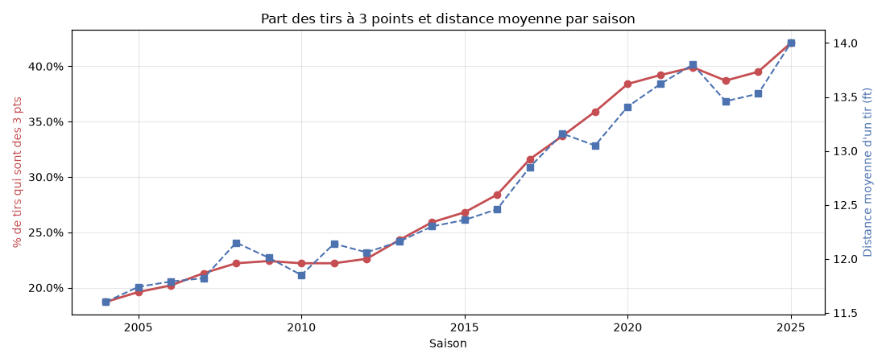

**Comment l:** En abscisse, les saisons 2003-04 à 2024-25. Courbe rouge, axe de gauche : la part des tirs qui sont des 3 points. Courbe bleue, axe de droite : la distance moyenne d'un tir, en pieds. **Ce qu'elle montre.** La part de 3 points passe de 18,7 % à 42,1 %, avec un plateau jusqu'en 2012 puis une montée presque linéaire ; la distance moyenne suit, de 11,6 à 14 pieds. Il y a deux époques du jeu : c'est la raison de la fenêtre 2015-16 et suivantes, et de la variable `saison_debut` gardée en réserve pour l'étape d'optimisation.

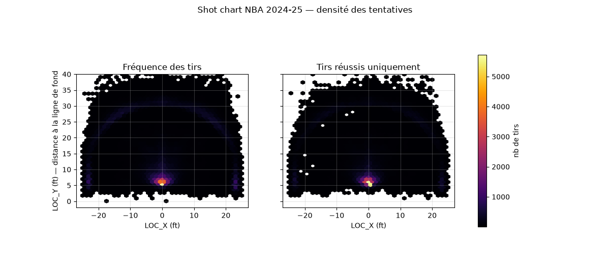

**Comment l:** Le demi-terrain vu du dessus, panier en bas au centre (`LOC_X` = 0, `LOC_Y` ≈ 5). Chaque hexagone est coloré selon le nombre de tirs qui en partent, du noir (peu) au jaune (beaucoup). À gauche toutes les tentatives, à droite les tirs réussis seulement. **Ce qu'elle montre.** Deux foyers : le cercle, en jaune, et un arc continu juste derrière la ligne à 3 points ; entre les deux, la mi-distance est presque vide. La carte de droite a la même structure : la réussite ne déplace pas les tirs, elle les éclaircit. C'est la traduction spatiale de la figure 1 : les équipes ne prennent plus que les deux tirs les plus rentables.

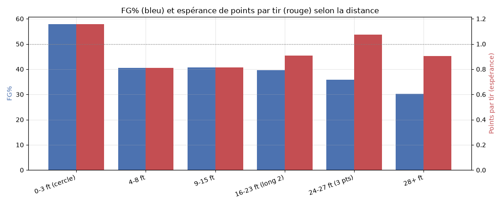

**Comment l:** Six tranches de distance. Barre bleue, axe de gauche : le pourcentage de réussite. Barre rouge, axe de droite : les points obtenus en moyenne par tir, c'est-à-dire réussite × valeur du tir (2 ou 3). La ligne pointillée marque 1 point par tir. **Ce qu'elle montre.** La réussite baisse avec la distance, de 58 % au cercle à 30 % au-delà de 28 pieds. Mais l'espérance de points, elle, n'est pas monotone : le long 2 points (16-23 pieds) rapporte 0,80 point par tir, le 3 points (24-27 pieds) 1,07. Un tir rentable se prend au cercle ou derrière l'arc, pas entre les deux : c'est l'explication économique de la figure 2.

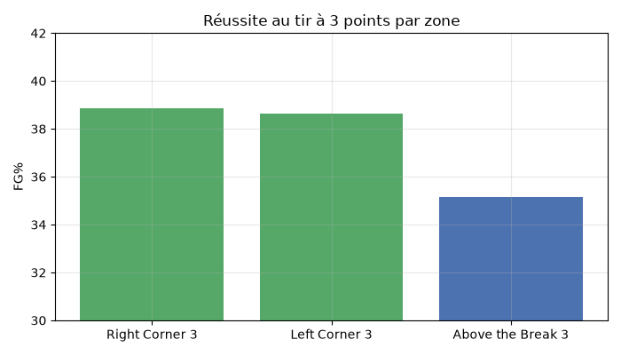

**Comment l:** Trois zones de tir à 3 points ; la hauteur est le pourcentage de réussite, l'axe va de 30 à 42 % pour rendre l'écart visible. **Ce qu'elle montre.** Les deux corners réussissent à 38,7 et 38,9 %, le 3 points de face (« Above the Break ») à 35,2 % : 3,5 points d'écart, confirmés par le test du χ². Deux explications : la ligne est plus proche dans les corners (22 pieds contre 23,75), et ce sont souvent des tirs ouverts reçus après une passe. Pour le modèle, la zone apporte donc une information que la distance seule ne donne pas.

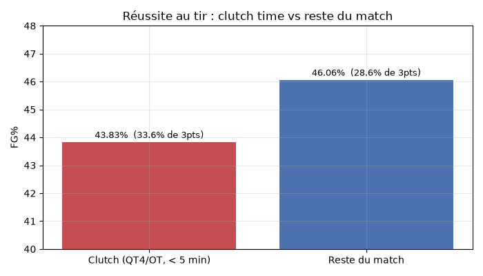

**Comment l:** Deux situations : le « clutch », 4e quart-temps ou prolongation, moins de 5 minutes à jouer, match serré ; et le reste du match. La hauteur est le pourcentage de réussite ; entre parenthèses, la part de tirs à 3 points. **Ce qu'elle montre.** 43,8 % contre 46,1 %, soit 2,2 points de moins en fin de match serré, et une part de 3 points qui monte de 28,6 à 33,6 %. La pression dégrade la réussite, en partie parce que les équipes prennent plus de risques pour recoller au score. C'est ce qui justifie les variables de temps restant dans le modèle.

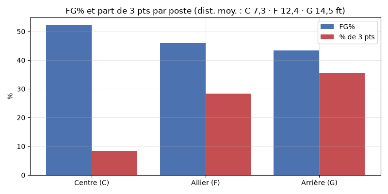

**Comment l:** Trois postes, Centre, Ailier, Arrière. Barre bleue : le pourcentage de réussite ; barre rouge : la part de tirs à 3 points ; le titre donne la distance moyenne de tir par poste. **Ce qu'elle montre.** Les pivots réussissent 52 % de leurs tirs et ne prennent presque pas de 3 points (8 %) ; les arrières 43 %, avec 36 % de 3 points. Le poste résume un profil de tir, distance et type. Une fois la distance et le geste connus, il reste peu d'information propre au poste : c'est ce que confirment ses poids faibles dans la régression logistique.

Relations entre variables explicatives : `SHOT_DISTANCE`, `LOC_X`, `LOC_Y`, `BASIC_ZONE` et `SHOT_TYPE` décrivent le même lieu à des finesses différentes (corrélation 0,9996 entre la distance et sa valeur recalculée depuis les coordonnées, après correction). Relations avec la cible : le geste est le facteur le plus discriminant (dunk 89 %, jump shot 38 %), puis la distance ; le poste, le domicile et le moment du match ont un effet réel mais faible. Distributions et valeurs aberrantes avant et après traitement : la distribution des distances est bimodale (pic au cercle, bosse à l'arc) et stable dans le temps ; les tirs de plus de 42 pieds (Backcourt) ont été retirés.

**Conclusions pour la modélisation.** Un modèle de classification probabiliste, entraîné sur toute la ligue et non sur vingt joueurs, sur les seules saisons du basket moderne ; les variables de lieu et de geste porteront l'essentiel du signal ; le découpage doit être temporel ; la métrique doit juger la probabilité, pas la classe.

---

# RENDU 2 — Rapport de modélisation (en cours)

## 3. Étapes de réalisation

### Classification du problème

**Type.** Classification supervisée binaire : la cible `SHOT_MADE` vaut 0 ou 1 et elle est connue pour chaque tir. **Tâche** : estimer la probabilité de réussite d'un tir à partir de son contexte, la classe prédite n'ayant pas d'intérêt en soi.

**Métrique principale : le log-loss.** Il répond à la question « la probabilité prédite est-elle juste ? » et pénalise fortement une prédiction confiante et fausse. L'accuracy n'est pas retenue comme arbitre : elle impose un seuil, ne distingue pas 0,51 de 0,95, et reste basse par nature sur un événement incertain (un tir « à 60 % » rate quatre fois sur dix même pour un modèle parfait). **Métriques secondaires** : l'AUC, qui mesure le classement des tirs réussis devant les ratés, et la courbe de calibration, qui vérifie que « 40 % prédits » correspond à 40 % de tirs rentrés. L'accuracy est affichée pour information.

### Choix du modèle et optimisation

**Algorithmes testés à la baseline** (notebook `03_modelisation.ipynb`, compte rendu `output/modelisation.md`) : un plancher qui prédit la moyenne du train pour tout tir, une régression logistique avec standardisation dans un `Pipeline`, un arbre de décision libre puis limité à la profondeur 6. Entraînement sur `train`, jugement sur `validation`.

| Modèle | log-loss | AUC |
|---|---:|---:|
| Plancher : 46,3 % pour tout tir | 0,692 | 0,500 |
| Régression logistique | 0,650 | 0,642 |
| Arbre de décision, profondeur 6 | 0,646 | 0,643 |
| Arbre de décision libre (87 niveaux, 576 000 feuilles) | 16,3 | 0,542 |

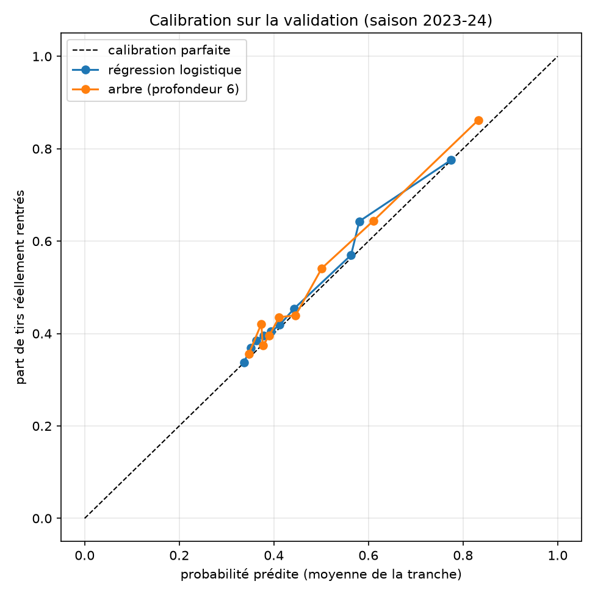

**Comment l:** Les tirs de la validation sont rangés en dix tranches selon la probabilité prédite. En abscisse, la probabilité moyenne prédite de la tranche ; en ordonnée, la part de tirs réellement rentrés. La diagonale pointillée est la calibration parfaite. **Ce qu'elle montre.** Les deux courbes suivent la diagonale de 0,35 à 0,85 : quand un modèle annonce 60 %, environ 60 % des tirs rentrent. L'arbre (orange) couvre une plage plus large, jusqu'à 0,83 ; la régression (bleu) s'arrête à 0,77. C'est la propriété que le cadrage demande : des probabilités justes, pas seulement un bon classement.

**Modèle sélectionné comme référence : la régression logistique.** Pas parce qu'elle a le meilleur score, l'arbre limité la devance de 0,004, mais parce qu'elle est le modèle le plus simple, stable, calibré, et que chacun de ses poids s'explique en une phrase. Elle est sauvegardée dans `models/` avec la liste exacte de ses 24 colonnes.

**Algorithmes écartés et pourquoi** : SVM (coût impraticable sur 1,66 million de lignes), k plus proches voisins (lent, mauvais avec des colonnes 0/1 mélangées à des distances), naïf bayésien (variables fortement redondantes).

**Optimisation** : à venir en décembre, réglage des paramètres (profondeur de l'arbre, régularisation de la régression), forêt aléatoire, variante avec la saison comme variable. **Modèles avancés** : à venir en février, gradient boosting, deep learning.

### Interprétation des résultats

**Ce que les modèles disent.** Pour la régression logistique, les poids dominants sont `type_geste_Dunk` (+0,38) et `SHOT_DISTANCE` (−0,31), puis les zones proches du cercle ; le moment du match, le domicile et le poste pèsent entre 0,01 et 0,02. Le poids négatif du layup (−0,09) se lit à distance et zone égales : effet des variables redondantes, limite connue d'un modèle linéa: L'arbre pose d'abord la question « moins de 2,5 pieds du cercle ? », puis « dunk ? », puis « moins de 20,5 pieds ? » et « moins de 3,5 secondes au quart-temps ? » : la distance pèse 77 % de son importance, le dunk 19 %.

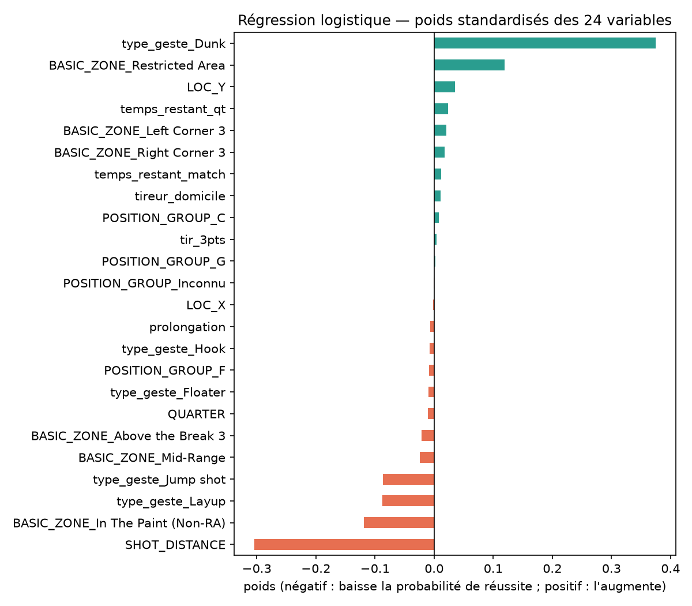

**Comment l:** Une barre par variable d'entrée ; sa longueur est le poids de la variable dans la somme pondérée, comparable d'une barre à l'autre parce que les variables sont standardisées. Vert, vers la droite : augmente la probabilité de réussite ; orange, vers la gauche : la diminue. **Ce qu'elle montre.** Deux poids dominent, `type_geste_Dunk` (+0,38) et `SHOT_DISTANCE` (−0,31) ; les zones proches du cercle suivent. Tout le reste, temps, domicile, poste, est entre −0,03 et +0,04. Le poids négatif de `type_geste_Layup` se lit à distance et zone égales, pas isolément : la redondance entre distance, coordonnées et zones répartit l'effet entre plusieurs colonnes.

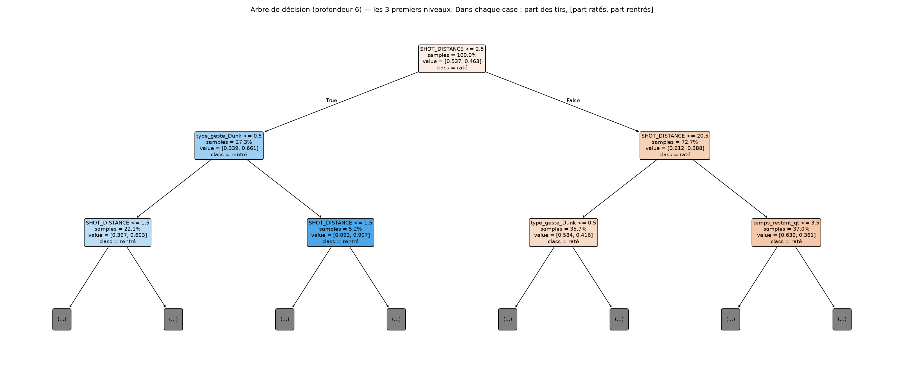

**Comment l:** Chaque case est une question sur une colonne ; la branche de gauche est la réponse « oui », celle de droite « non ». `samples` est la part des tirs du train qui passent par la case, `value` la part de ratés puis de rentrés ; la couleur va de l'orange (majorité de ratés) au bleu (majorité de rentrés). **Ce qu'elle montre.** La première question est « distance ≤ 2,5 pieds », sous le cercle ou non. Sous le cercle, « dunk ou non » isole une case à 91 % de réussite. Loin du cercle, la distance encore (≤ 20,5 pieds), puis les 3,5 dernières secondes d'un quart-temps, les tirs au buzzer. En trois questions, l'arbre reproduit le raisonnement d'un entraîneur.

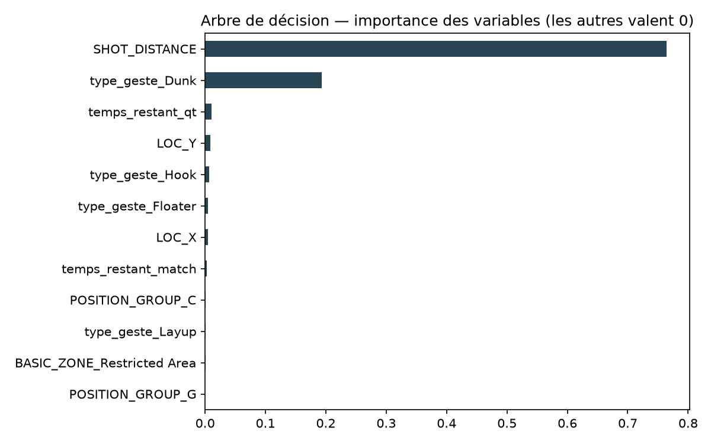

**Comment l:** Une barre par variable utilisée par l'arbre ; sa longueur est la part des coupures utiles qui lui est attribuée, le total valant 1. Les variables absentes valent 0. **Ce qu'elle montre.** La distance pèse 77 %, le dunk 19 %, les autres moins de 1 % chacune. Avec six niveaux, l'arbre consacre son budget aux colonnes qui séparent le plus ; les zones n'apparaissent pas, parce que la distance porte déjà la même information. C'est cohérent avec la régression logistique, où ces deux mêmes variables dominent.

**Analyse des erreurs.** L'arbre libre atteint un log-loss de 0,007 sur le train et de 16,3 sur la validation : sur-apprentissage caractérisé, qui justifie la limitation de profondeur. Les deux modèles limités sont légèrement pessimistes en moyenne (46 % prédits contre 47,5 % réels en 2023-24) : ils héritent du taux du train, la saison 2023-24 ayant été plus adroite. C'est l'effet époque, que la variante avec la saison devra traiter. La différence entre tirage au hasard et découpage par saison n'est que de 0,0007 de log-loss sur cette fenêtre : le jeu change lentement, mais le découpage temporel reste le seul qui reproduise l'usage réel.

**Techniques d'interprétabilité.** Poids standardisés et importance des variables à ce stade ; SHAP prévu en février.

**Facteurs de performance.** L'AUC modeste (0,64) est structurelle : rien dans la table ne décrit la défense ni l'adresse du joueur ce soir-là. Le modèle estime ce qu'un tir vaut en moyenne, ce qui est l'objectif ; il ne peut pas classer ce qu'il ne voit pas.

---

# RAPPORT FINAL (à venir)

## 4. Conclusions tirées

### Difficultés rencontrées

Déjà identifiées à ce stade, à compléter en fin de projet :

- **Enjeux de données.** Trois défauts de la source, dont un invisible à l'exploration. (1) Une version « tout-en-un » du dataset, diffusée sur le Drive de la source, n'était pas la même table que les fichiers par saison (24 colonnes, 4 443 714 lignes) : détectée par les contrôles automatiques du pre-processing. (2) Le fichier 2024-25 n'a pas les postes des joueurs : traité par imputation du dernier poste connu. (3) Les coordonnées `LOC_X` et `LOC_Y` sont dix fois trop petites sur les saisons 2019-20, 2020-21 et 2021-22, et l'axe `LOC_X` y est en miroir ; vraisemblablement une conversion d'unités appliquée deux fois à la source, avec un axe retourné. Le contrôle « coordonnées hors terrain » de l'EDA ne pouvait voir ni l'un ni l'autre, et le contrôle par la distance recalculée ne voit pas le miroir. Correction `LOC_X` ← −10·`LOC_X`, `LOC_Y` ← 10·`LOC_Y` − 52,5, vérifiée par deux contrôles indépendants : corrélation avec la distance officielle (0,9996 après correction) et signe du corner gauche identique sur les dix saisons. Le miroir a été repéré en croisant nos contrôles avec ceux d'un coéquipier : la confrontation des pipelines au sein de l'équipe a servi de validation. Toute carte de tir sur ces saisons sans correction est fausse.

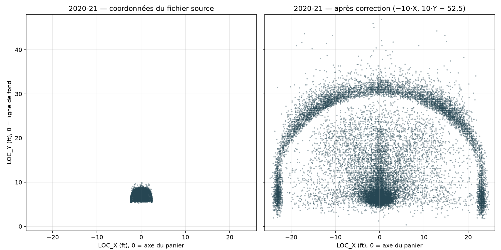

**Comment l:** Un tir sur dix de la saison 2020-21, placé sur le demi-terrain, panier en bas. À gauche, les coordonnées telles qu'elles sont dans le fichier source ; à droite, après correction. **Ce qu'elle montre.** À gauche, tous les tirs tiennent dans un rectangle de 5 pieds de large, ce qui est physiquement impossible : l'échelle est dix fois trop petite. À droite, le cercle, l'arc à 3 points et les deux corners sont à leur place, identiques aux autres saisons. Le miroir gauche-droite, lui, ne se voit pas à l'œil sur un nuage symétrique : c'est le contrôle du signe de `LOC_X` par corner, saison par saison, qui l'a établi.

- **Verrou scientifique.** Le résultat d'un tir dépend de facteurs absents de la table (défense, fatigue, forme du jour) : la performance brute d'un modèle de qualité de tir est plafonnée par nature, et c'est la justesse de la probabilité, pas le classement, qui doit être jugée.
- **Questions de pertinence.** Le libellé du geste est écrit après le tir, donc partiellement lié au résultat. Quatre des vingt joueurs ESPN n'ont aucun tir dans la fenêtre retenue.
- **Retards, lacunes, contraintes informatiques.** [à compléter en fin de projet]. À ce stade, le projet est en avance d'un mois sur le planning.

### Bilan

[à compléter en fin de projet : contribution majeure, modifications depuis l'itération précédente, résultats contre benchmark, objectifs atteints ou non, intégration métier.]

## 5. Suite du projet

[à compléter en fin de projet]. Pistes déjà notées : variante avec la saison comme variable ; variante « distance et angle du tir » pour la régression logistique ; variable « avec la planche » et « reverse » extraites du libellé ; variante avec l'identité du joueur pour mesurer ce qu'elle apporte ; comparaison réel − attendu pour les joueurs ESPN présents dans la fenêtre.

## 6. Bibliographie

- Dépôt de données DomSamangy/NBA_Shots_04_25 (GitHub) et API NBA.com via nba_api.
- Dataset Kaggle « NBA Shot Locations 1997-2020 ».
- Classement ESPN des 25 meilleurs joueurs NBA du XXIe siècle, juillet 2024.
- Documentation scikit-learn : régression logistique, arbres de décision, calibration, persistance des modèles (joblib).

## 7. Annexes

**Planning (diagramme de Gantt).** [à produire en fin de projet]. Jalons : cadrage 29 juin ; EDA 4 septembre ; pre-processing 2 octobre ; baseline 6 novembre (faite le 6 octobre) ; métriques et optimisation 11 décembre ; modélisation avancée 5 février 2027 ; rapport final 5 mars 2027 ; Streamlit et soutenance 31 mars 2027.

**Description technique des fichiers de code.**

| Fichier | Rôle | Entrées | Sorties |
|---|---|---|---|
| `notebooks/01_eda.ipynb` | exploration et data visualisation (requêtes DuckDB) | 22 CSV décompressés dans `data/shots_04_25/csv/` | figures `output/figures/`, chiffres de `output/eda.md` et `output/data.md` |
| `notebooks/02_preprocessing.ipynb` | nettoyage, variables dérivées, découpage, encodage (pandas) | 22 zips `data/shots_04_25/` | `data/processed/shots_clean_2015_2025.parquet`, `shots_encoded_2015_2025.parquet` |
| `notebooks/03_modelisation.ipynb` | baseline : plancher, régression logistique, arbre (scikit-learn) | `shots_encoded_2015_2025.parquet` | `models/baseline_regression_logistique.joblib`, `data/processed/predictions_validation_baseline.parquet`, figures `M1` à `M4` |
| `notebooks/archive/eda_kaggle.ipynb` | première EDA sur le dataset Kaggle | `data/NBA shot locations/` | figures `G1` à `G4` |
| `requirements.txt` | dépendances épinglées (pandas 3.0.5, scikit-learn 1.9.1, pyarrow, duckdb, matplotlib, scipy, joblib, jupyterlab) | — | — |
