# Analyse des tirs NBA : données brutes, preprocessing et modèles testés

**Auteur :** Paul · **Projet :** DataScientest, Analyse des tirs de joueurs NBA

## Contexte

- **Sujet :** comparer les tirs (fréquence et efficacité par situation de jeu et par localisation) de joueurs parmi les meilleurs du 21e siècle selon ESPN (objectif 1), et estimer la probabilité que leurs tirs rentrent (objectif 2).
- **Source :** les 22 CSV saisonniers du dépôt `DomSamangy/NBA_Shots_04_25` (données NBA.com), saisons régulières 2003-04 à 2024-25. J'ai vérifié que ces fichiers sont identiques, au tir près, à l'API officielle stats.nba.com.
- **Contenu de ce dossier (`test/paul/`) :**
  - `preprocessing/` : le code. Il reconstruit tout le dataset depuis les CSV bruts en moins d'une minute, et s'arrête si un contrôle de qualité échoue.
  - `figures/` : les figures de ce rapport.
  - `resultats/` : les chiffres produits par le code (audit du nettoyage, contrôles, résultats des modèles).
  - `dictionnaire_donnees.md` : chaque colonne du dataset expliquée avec un exemple chiffré.
  - `rapport.ipynb` : le notebook qui affiche le code et les figures de ce rapport.
- **Vocabulaire :** les termes techniques sont expliqués dans le lexique, en fin de rapport.

## Chiffres clés

| Indicateur | Valeur |
|---|---|
| Données brutes | 4 450 789 tirs, 22 saisons, 2 265 joueurs, 26 colonnes |
| Fenêtre retenue | **10 saisons, 2015-16 à 2024-25** |
| **Dataset final** | **2 099 311 tirs**, 11 975 matchs, 1 441 joueurs |
| Coordonnées corrigées (3 saisons fausses dans le fichier) | 595 821 tirs |
| Lignes retirées dans la fenêtre (erreurs, doublons, non-tirs) | 945, soit 0,04 % |
| Joueurs étudiés, sélectionnés par une règle | **11** |
| Features construites | 32 (11 numériques, 14 oui / non, 7 catégorielles) |
| Features utiles au modèle, après sélection | **12** : même note qu'avec les 32 (§3.4) |
| Contrôles de validation indépendants | 9 sur 9 réussis |
| Contrôle de « triche » (fuite de données) | aucune fuite détectée |
| Premiers modèles, note de 0,5 (hasard) à 1 (parfait) | 0,653 (régression logistique) et **0,670** (gradient boosting), sans aucun réglage |

---

## 1. Les données brutes

Le fichier brut contient **4 450 789 tirs** sur 22 saisons. Une ligne correspond à une tentative de tir (lancers francs exclus), décrite par 26 colonnes : le joueur et son équipe, le match, le type de geste (`ACTION_TYPE`), la zone, la position sur le terrain (`LOC_X`, `LOC_Y`), la distance (`SHOT_DISTANCE`), le moment du match et le résultat (`SHOT_MADE`). En explorant ces données, j'ai trouvé deux problèmes majeurs, qui ont guidé tout le reste du travail.

### 1.1 Avant 2010-11, la position des tirs sous le panier est perdue

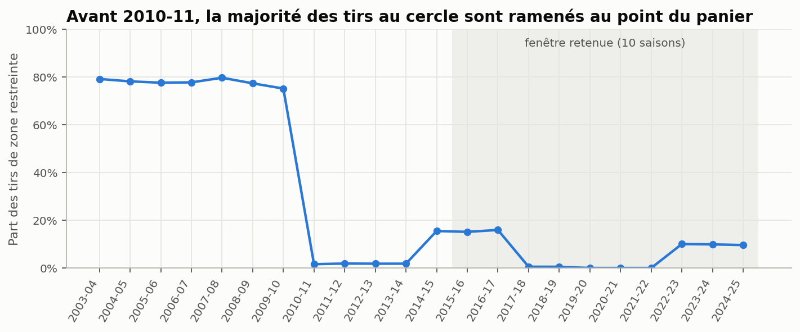

Jusqu'en 2009-10, **77,8 %** des tirs pris sous le panier sont enregistrés exactement au point du panier : leur position réelle est perdue. À partir de 2010-11, cette part tombe à **5,7 %**. Un test de comparaison de deux proportions confirme qu'il s'agit d'un changement dans la façon de collecter les données, et pas du hasard (écart de 72 points, z = 880, p < 10⁻³⁰⁰).

**Conséquence :** pour les saisons anciennes, une carte des tirs près du panier n'a pas de sens, et la position exacte du tir ne peut pas servir au modèle. C'est la première raison de ne garder que des saisons récentes (§2.1).

### 1.2 Trois saisons ont des coordonnées fausses

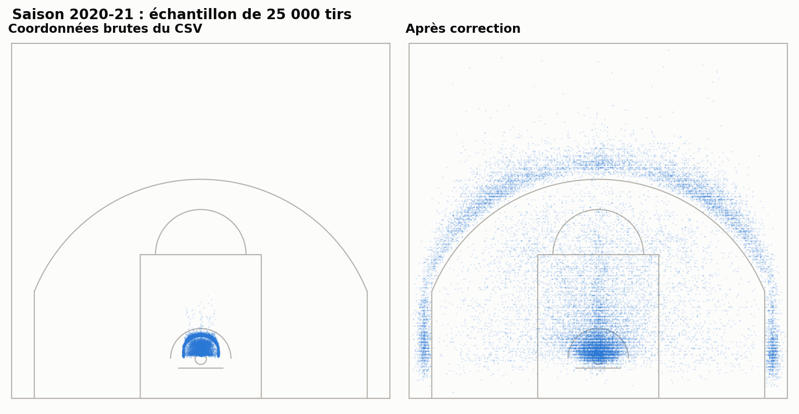

À gauche, les tirs de 2020-21 tels qu'ils sont dans le fichier : tous les tirs sont tassés dans un petit rectangle. À droite, après ma correction : on retrouve l'arc à 3 points, les corners et le cercle.

Pour **2019-20, 2020-21 et 2021-22** (595 821 tirs), `LOC_X` est **divisé par 10 et de signe inversé** (le corner gauche se retrouve à droite), et `LOC_Y` est lui aussi divisé par 10. La distance `SHOT_DISTANCE`, elle, reste juste : c'est ce qui m'a permis de détecter l'erreur et de la corriger (§2.2).

**Conséquence :** toute carte de tirs faite sur les coordonnées brutes de ces trois saisons est fausse, et inversée gauche / droite.

### 1.3 Les autres constats sur les données brutes

| Constat | Ce que j'en fais |
|---|---|
| **Le jeu a beaucoup changé** : la part des tirs à 3 points passe de 19 % en 2003-04 à 42 % en 2024-25, et la mi-distance s'effondre | Deuxième raison de garder une fenêtre récente (§2.1) |
| **`EVENT_TYPE` recopie le résultat du tir** (« Made Shot » / « Missed Shot ») : 0 écart avec `SHOT_MADE` sur les 4,45 M de lignes | Colonne supprimée : un modèle qui la verrait « tricherait » |
| **`POSITION` est vide pour toute la saison 2024-25** (219 515 tirs) | Complétée avec le dernier poste connu du joueur |
| **Des lignes en double**, des lignes « No Shot » qui ne sont pas des tirs, et des tirs dont le type (2 ou 3 points) contredit la zone | Traités au cas par cas (§2.2) |
| **28 joueurs écrits de deux façons** (Jokić et Jokic) | Toutes les jointures se font sur l'identifiant `PLAYER_ID` |

---

## 2. Preprocessing

### 2.1 Périmètre

#### Une fenêtre de 10 saisons

Je garde les 10 dernières saisons, de 2015-16 à 2024-25, pour trois raisons.

1. **Les coordonnées anciennes ne sont pas fiables** (§1.1). La fenêtre est entièrement du bon côté de la rupture de 2010-11.
2. **Le jeu a changé.**

   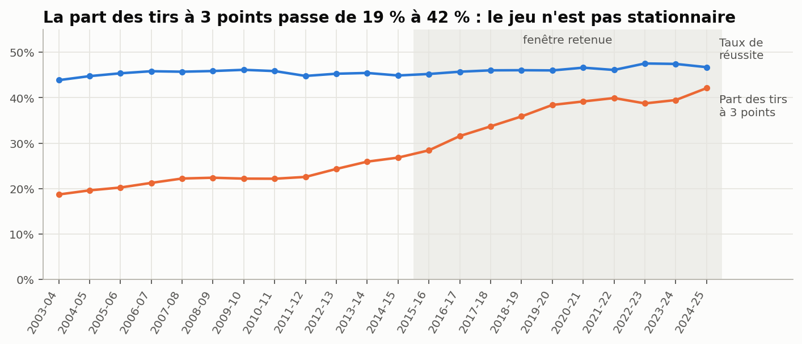

   La part des tirs à 3 points passe de 19 % à 42 % (corrélation de Spearman avec la saison : 0,98). La mi-distance passe de 24,6 % des tirs en 2015-16 à 9,7 % en 2024-25. Des tirs de 2005 et de 2025 ne décrivent pas le même basket. Une fenêtre récente donne un jeu plus homogène, plus proche de ce qu'un modèle devra prédire aujourd'hui.
3. **Le volume reste largement suffisant :** 2,1 millions de tirs.

#### Les joueurs : une règle plutôt qu'un choix à la main

Le sujet parle de joueurs « parmi les meilleurs du 21e siècle selon ESPN ». La liste n'est pas imposée : je la construis avec une règle simple, appliquée automatiquement par le code. Un joueur est retenu s'il est :

1. dans le **classement ESPN** des 25 meilleurs joueurs du 21e siècle (juillet 2024) ;
2. **encore actif** : il a joué en 2024-25 ;
3. **installé dans la ligue** : au moins 5 saisons dans la fenêtre ;
4. **assez représenté** : au moins 5 000 tirs dans la fenêtre, pour pouvoir évaluer un modèle joueur par joueur.

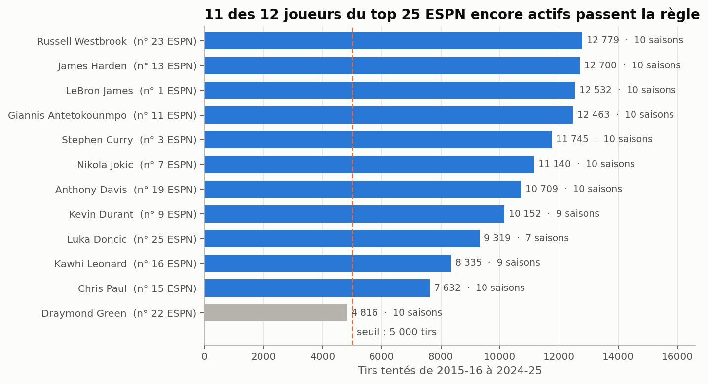

**Résultat : 11 joueurs**, 119 506 tirs au total : LeBron James, Stephen Curry, Nikola Jokić, Kevin Durant, Giannis Antetokounmpo, James Harden, Chris Paul, Kawhi Leonard, Anthony Davis, Russell Westbrook et Luka Dončić.

- **Draymond Green**, seul actif du classement écarté, n'a que 4 816 tirs : c'est un défenseur et un passeur, qui tire peu.
- **Les 13 retraités** du classement sont écartés par la règle « encore actif ».

Les seuils se changent dans `preprocessing/config.py` (`MIN_SEASONS`, `MIN_SHOTS`) : la liste se met alors à jour seule.

#### Un seul modèle, entraîné sur toute la ligue

Le modèle apprend sur **les tirs de tous les joueurs** (2,1 M), puis je le présente sur les 11 joueurs. Entraîner sur 11 joueurs seulement (120 000 tirs) donnerait moins d'exemples, et ce qui fait qu'un tir rentre (distance, geste) est le même pour tout le monde. Le talent propre à chaque joueur est traité au §3.5.

### 2.2 Nettoyage

#### Correction des coordonnées

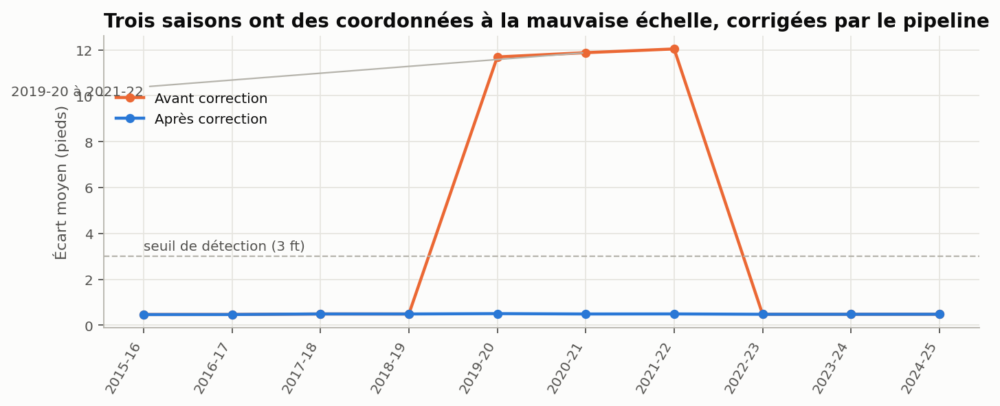

**Comment j'ai détecté l'erreur.** `SHOT_DISTANCE` est la distance au panier, arrondie au pied inférieur. Recalculée à partir de la position du tir (`LOC_X`, `LOC_Y`), elle doit retomber dessus à 0,5 pied près. C'est le cas pour 7 saisons sur 10. Pour 2019-20, 2020-21 et 2021-22, l'écart atteint **11,7 à 12,0 pieds**.

**Correction.** `x = −LOC_X × 10` et `y = (LOC_Y − 5,25) × 10`, sur les 595 821 tirs concernés, marqués par la colonne `coord_corrigee`. Après correction, l'écart retombe à 0,49 à 0,51 pied, comme les autres saisons. Le code détecte les saisons fausses à partir des données (seuil de 3 pieds d'écart) et s'arrête si la correction ne ramène pas l'écart sous 1 pied.

**Position du panier.** Je place le centre du panier à **5,25 pieds** de la ligne de fond : c'est la dimension officielle (planche à 4 pieds, centre du cercle 1,25 pied devant). Avec cette valeur, la distance recalculée retombe sur `SHOT_DISTANCE` pour 99,8 % des tirs. Un panier placé à 5,8 pieds, par exemple, ne correspond plus qu'à 66 % des tirs.

#### Les autres étapes

| Étape | Règle | Lignes concernées | Décision |
|---|---|---|---|
| Fenêtre | Saisons avant 2015-16 | 2 350 533 | Retirées (§2.1) |
| Non-tirs | Libellé `No Shot` | 81 | Supprimés |
| Colonne qui « triche » | `EVENT_TYPE` recopie le résultat du tir | 1 colonne | Supprimée |
| Doublons exacts | Lignes identiques sur toutes les colonnes : 98 lignes en trop | 98 | **97 conservées** : ce sont des claquettes et des rebonds remis (*tips*, *putbacks*), qui peuvent réellement se répéter dans la même seconde au même endroit. Marquées `doublon_plausible`. **1 supprimée**. |
| Type de tir contre zone | Tir à 3 points sous le panier ou à mi-distance, ou tir à 2 points dans une zone à 3 points | 862 | Supprimés : impossible de savoir laquelle des deux colonnes est fausse |
| Type de tir contre distance | Tir à 3 points à moins de 21 pieds, ou à 2 points à plus de 24,75 pieds | 7 (dont 6 déjà comptés) | Supprimés |
| Poste manquant | `POSITION` vide pour toute la saison 2024-25 | 219 515 | Complété avec le dernier poste connu du joueur. Restent 18 110 tirs de 103 recrues, codés `Inconnu`. |
| Date de match | Un match porte deux dates | 1 match | Date la plus ancienne |
| Noms | 28 joueurs écrits de deux façons | 28 joueurs | Accents retirés ; jointures sur `PLAYER_ID` |

Dans la fenêtre, je retire 945 lignes sur 2 100 256, soit 0,04 %. L'essentiel du travail porte sur la **correction** des données, pas sur leur suppression.

**Valeur manquante restante :** `reussite_tirs_precedents`, vide pour le premier tir d'un joueur dans un match (11,7 % des tirs), parce qu'il n'y a pas encore de tir précédent. Elle est complétée au moment de la modélisation.

### 2.3 Features

#### Catalogue

Toutes les features sont connues **au moment où le joueur arme son tir** : aucune ne s'appuie sur le résultat du tir, ni sur un tir postérieur. Le détail, avec formules et exemple chiffré, est dans `dictionnaire_donnees.md`.

| Famille | Features | Comment je les construis |
|---|---|---|
| **Où** | `distance_ft`, `angle_deg`, `LOC_X`, `LOC_Y`, `BASIC_ZONE`, `tir_3pts`, `tir_backcourt` | Distance par Pythagore, angle par trigonométrie (0° = face au panier, 90° = corner), sur les coordonnées corrigées |
| **Comment** | `geste_famille`, `ACTION_TYPE`, `tir_planche`, `en_course`, `en_desequilibre`, `alley_oop` | Les 52 libellés NBA regroupés en 6 familles (dunk, layup, claquette, bras roulé, tir créé, tir simple), plus des modificateurs lus dans le libellé (« Driving », « Fadeaway », « Alley Oop »...) |
| **Quand** | `QUARTER`, `temps_restant_periode_s`, `temps_ecoule_match_s`, `fin_de_periode`, `derniere_minute`, `prolongation` | Temps converti en secondes ; tirs au buzzer (3 dernières secondes) ; dernière minute du 4e quart-temps ou d'une prolongation |
| **Contexte** | `domicile`, `equipe`, `adversaire`, `jours_repos`, `back_to_back`, `premier_match_saison` | Domicile déduit de l'équipe qui reçoit ; repos calculé sur le calendrier de chaque équipe |
| **Qui et dans quel match** | `POSITION`, `POSITION_GROUP`, `saisons_depuis_premiere_apparition`, `experience_censuree`, `tirs_deja_pris`, `premier_tir_match`, `reussite_tirs_precedents` | Expérience mesurée sur tout l'historique du CSV (depuis 2003-04) ; tirs déjà pris et réussite des 3 derniers tirs **avant** celui-ci dans le match |

**Deux précisions de construction.**

- **Domicile.** Le fichier donne l'équipe du tireur par un identifiant, et les équipes du match par une abréviation. L'abréviation d'une équipe est la seule qui apparaît dans **tous** ses matchs de la saison, ce qui permet de relier les deux, renommages compris (LA Clippers et Los Angeles Clippers).
- **Tirs dans la même seconde.** Pour 1 658 cas où un joueur tire deux fois dans la même seconde, `reussite_tirs_precedents` reste vide : je ne peux pas savoir lequel des deux tirs vient en premier. Pour les tirs suivants, j'applique une règle physique : un tir raté précède forcément un tir réussi du même joueur, puisqu'un panier rend le ballon à l'adversaire.

**Feature volontairement non construite :** le pourcentage de réussite du joueur sur la saison. Il est calculé avec le tir que je veux prédire, donc ce serait une fuite de données.

#### Ce que disent les features

**Le geste.**

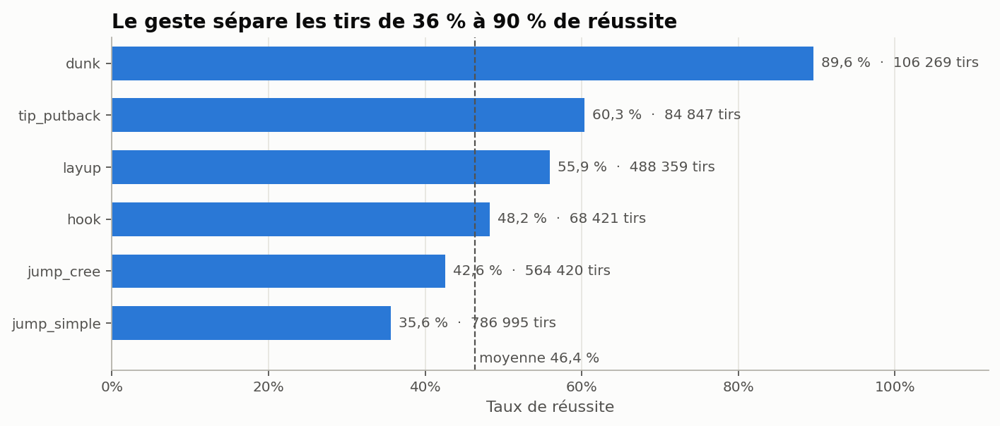

La réussite va de 35,6 % (tir simple) à 89,6 % (dunk). Test du χ² : χ² = 144 500 (5 ddl), p < 10⁻³⁰⁰, **V de Cramér = 0,26**, un lien fort pour une variable de tir.

Les tirs « créés » (pull-up, step back, fadeaway, floater) réussissent mieux que les tirs simples (42,6 % contre 35,6 %). La distance l'explique en partie (15,9 pieds en moyenne contre 23,1), mais pas entièrement : à distance égale (15 à 22 pieds), l'écart reste de 7 points (43,7 % contre 36,6 %). Mon hypothèse : ces tirs sont surtout pris par des joueurs qui créent leur propre tir, donc souvent meilleurs tireurs.

**La distance.**

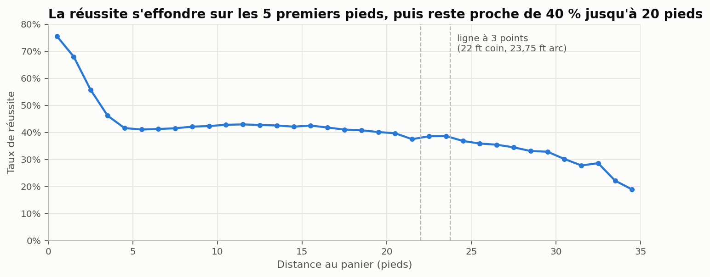

La réussite passe de 66,8 % sous 3 pieds à environ 40 % dès 5 pieds, reste proche de 42 % jusqu'à 20 pieds, puis baisse derrière la ligne à 3 points (36,0 % entre 24 et 27 pieds). Corrélation point-bisériale r = −0,22 (Spearman −0,24), p < 10⁻³⁰⁰.

La relation **n'est pas régulière** : un plateau de 15 pieds sépare deux chutes. Les modèles qui supposent un effet régulier la représenteront mal ; les modèles à base d'arbres de décision la gèrent telle quelle (§3).

**Le contexte.**

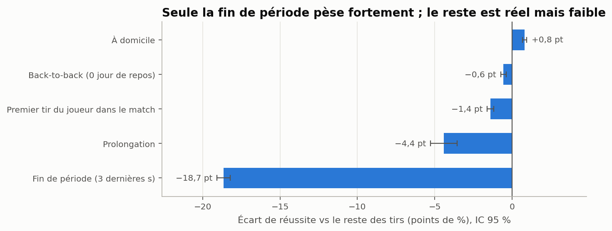

| Condition | Part des tirs | Réussite | Reste des tirs | Écart | IC 95 % | p |
|---|---|---|---|---|---|---|
| Fin de période (3 dernières s) | 2,1 % | 28,1 % | 46,7 % | −18,7 pt | ± 0,4 | < 10⁻³⁰⁰ |
| Dernière minute du match | 2,5 % | 41,8 % | 46,5 % | −4,6 pt | | |
| Prolongation | 0,6 % | 42,0 % | 46,4 % | −4,4 pt | ± 0,9 | 10⁻²³ |
| Premier tir du joueur dans le match | 11,6 % | 45,1 % | 46,5 % | −1,4 pt | ± 0,2 | 10⁻³⁸ |
| Back-to-back (joué la veille) | 18,0 % | 45,9 % | 46,5 % | −0,6 pt | ± 0,2 | 10⁻⁹ |
| À domicile | 50,0 % | 46,8 % | 46,0 % | +0,8 pt | ± 0,1 | 10⁻³³ |

Avec 2 millions de tirs, tout écart devient « significatif » : la vraie question est sa taille. Seule la fin de période pèse fortement, et elle traduit surtout le **choix** du tir (tirs forcés au buzzer) plutôt qu'une baisse d'adresse. Domicile, repos et premier tir sont réels mais inférieurs à 1,5 point.

**Effet « main chaude ».** Après au moins 2 réussites sur les 3 derniers tirs, la réussite est de 46,7 %, contre 46,4 % après au plus 1 réussite : pas d'effet. C'est le résultat classique des études sur le sujet.

### 2.4 Dataset final et découpages

| Fichier | Contenu | Lignes | Colonnes | Taille |
|---|---|---|---|---|
| `data/interim/shots_model.parquet` | Colonnes utiles au modèle : identifiants, drapeaux, 32 features, découpages, cible | 2 099 311 | 45 | 43 Mo |
| `data/interim/shots_clean.parquet` | Mêmes tirs, avec en plus les colonnes brutes du CSV (pour l'analyse et les contrôles) | 2 099 311 | 59 | 49 Mo |

Les deux fichiers sont trop gros pour Git : n'importe qui les reconstruit avec la commande du pipeline (voir « Reproduire »).

**Ce qui reste à faire juste avant le modèle.** Un modèle ne travaille qu'avec des nombres. Trois transformations restent donc nécessaires : remplir les cases vides de `reussite_tirs_precedents`, transformer chaque catégorie en colonnes 0 / 1 (« dunk » devient une colonne `dunk` = 1), et mettre les nombres à la même échelle. Je ne les applique **pas** dans le fichier, volontairement : elles doivent être calculées sur les tirs d'apprentissage seulement, sinon le modèle aurait un aperçu des tirs de test. Le code est prêt (`build_preprocessor()` dans `preprocessing/model_features.py`).

**Découpages.**

| Découpage | Règle | Apprentissage | Validation | Test |
|---|---|---|---|---|
| `split` | Par match, tiré au sort de façon reproductible, 70 / 15 / 15 | 1 468 817 | 315 015 | 315 479 |
| `split_temps` | Par saison : 2015-16 à 2022-23, puis 2023-24, puis 2024-25 | 1 661 116 | 218 680 | 219 515 |

- **Pourquoi trois groupes.** Le modèle apprend sur le premier. Je compare les réglages sur le deuxième. Le troisième ne sert qu'une fois, à la fin, pour une note honnête sur des tirs que je n'ai jamais utilisés pour faire un choix.
- **Pourquoi par match.** Deux tirs du même match partagent le même contexte (adversaire, fatigue). Les mettre des deux côtés surestimerait la performance. Le code vérifie qu'aucun match n'est réparti sur plusieurs groupes.
- **Pourquoi aussi par saison.** C'est l'usage réel : prédire une saison que le modèle n'a jamais vue. La réussite passe de 46,2 % (apprentissage) à 47,4 % puis 46,7 %, et la part des tirs à 3 points de 35,7 % à 42,1 % : le modèle doit s'adapter à un jeu qui évolue.

### 2.5 Contrôles

#### Contrôle de « triche » (fuite de données)

**Le risque.** Une colonne peut contenir, sans que je m'en rende compte, une information sur le résultat du tir. Un modèle qui en profite obtient d'excellents résultats sur mes données, et ne sert à rien en situation réelle.

**Le test.** Pour chaque feature, je mesure à quel point elle sépare **à elle seule** les tirs réussis des ratés, avec une note de 0,5 (aucune aide) à 1 (séparation parfaite). C'est l'AUC. Une note supérieure à 0,80 pour une seule colonne trahirait une fuite : `EVENT_TYPE`, par exemple, aurait obtenu 1.

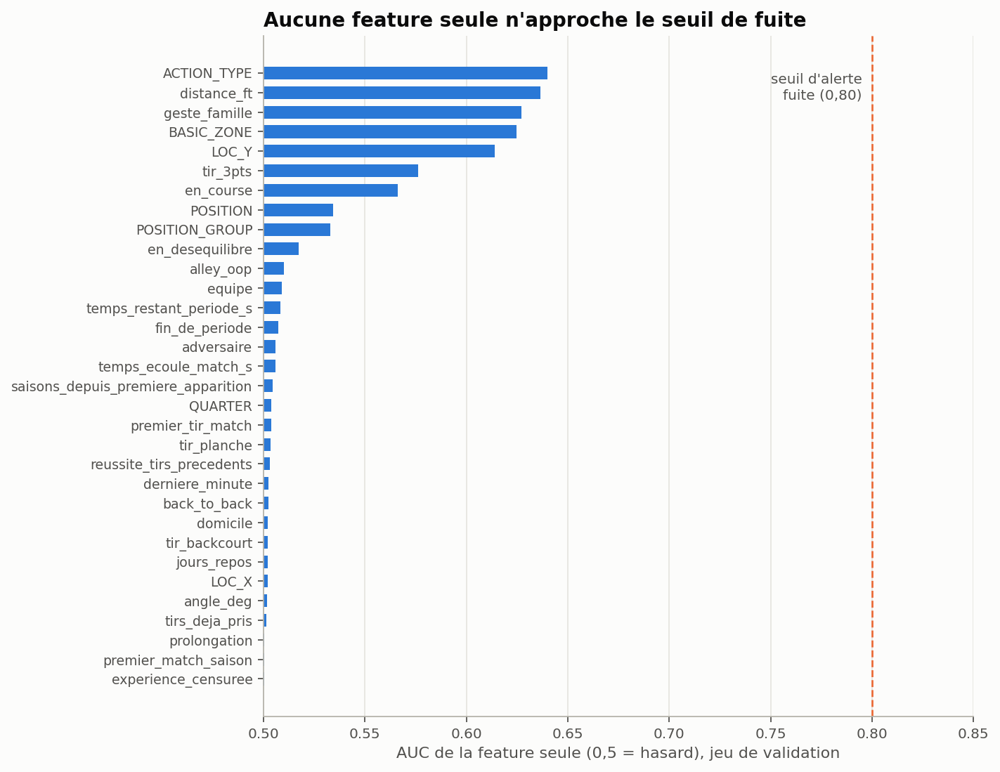

**Résultat.** La meilleure feature, le geste détaillé (`ACTION_TYPE`), obtient **0,640**, puis la distance 0,636. Aucune n'approche le seuil : **aucune fuite détectée.**

#### Validation indépendante

Pour vérifier que les features sont **justes**, et pas seulement que le code fait ce qu'il annonce, `python -m preprocessing.validate` les recalcule avec un second code, écrit autrement (pandas, tir par tir), puis compare.

| Contrôle | Méthode | Résultat |
|---|---|---|
| Séquence dans le match | Recalcul de `tirs_deja_pris` et `reussite_tirs_precedents` sur 70 104 tirs | 100 % identiques |
| Temps de jeu | Recalcul du temps écoulé et de la fin de période | 100 % identiques |
| Jours de repos | Recalcul sur le calendrier complet de 6 équipes-saisons (474 matchs) | 100 % identiques |
| Domicile | Une seule équipe à domicile par match ; part des tirs à domicile par saison | 0 match incohérent ; 49,8 % à 50,0 % |
| Correction des coordonnées | Chaque zone au bon endroit (sous le panier à moins de 4,5 pieds, corners à plus de 21,5 pieds de l'axe...) et **même côté du terrain pour le corner gauche sur toutes les saisons** | Saisons corrigées indiscernables des autres |
| Expérience | Recalcul depuis les CSV bruts, sur 200 000 tirs | 100 % identique |
| Sélection des joueurs | Règle du §2.1 réappliquée | Mêmes 11 joueurs |
| Découpages | Aucun match partagé ; tirage refait à l'identique ; même réussite dans chaque groupe | Conforme (écart de 0,08 pt) |
| Schéma | Colonne qui triche absente, cible hors des features, 6 familles de gestes | Conforme |

**Ce que ces contrôles ont apporté.** Le contrôle de séquence a révélé un cas ambigu (deux tirs du même joueur dans la même seconde), réglé par la règle physique du §2.3. Le contrôle du côté du terrain garantit que la correction des coordonnées ne laisse aucune saison inversée.

---

## 3. Modèles testés

J'ai entraîné deux modèles simples, **sans aucun réglage**, pour vérifier que le dataset est utilisable et voir quelles features comptent le plus. Ce sont des résultats de départ, à améliorer ensuite.

### 3.1 Les deux modèles

| Modèle | Comment il fonctionne |
|---|---|
| **Régression logistique** | Il donne un poids à chaque feature (« +x % si dunk », « −y % par pied ») et les additionne pour obtenir une probabilité. Simple et lisible, mais il suppose des effets réguliers. |
| **Gradient boosting** | Il combine des centaines de petits arbres de décision (« distance < 4 pieds ? geste = dunk ? »), chacun corrigeant les erreurs des précédents. Plus puissant : il capte les effets irréguliers, comme le plateau de la distance. |

Ils apprennent sur 500 000 tirs du groupe d'apprentissage et sont notés sur 300 000 tirs de validation, qu'ils n'ont jamais vus.

### 3.2 Résultats

| Modèle | Note (AUC) |
|---|---|
| Hasard (aucun modèle) | 0,500 |
| Régression logistique | 0,653 |
| Gradient boosting | **0,670** |
| Gradient boosting, testé sur la saison 2024-25 (`split_temps`) | 0,656 |

**Comment lire la note.** Je prends au hasard un tir réussi et un tir raté : avec 0,670, le modèle donne la probabilité la plus haute au tir réussi dans 67 % des cas. Le hasard ferait 50 %.

**Pourquoi 0,67 est un bon résultat.** Un tir NBA garde une grande part de hasard : même un tir facile est parfois raté. Et ce qui décide vraiment d'un tir (défenseur, contact, appuis, passe) n'est pas dans les données, comme le souligne le sujet. Pour ce problème, le plafond réaliste est autour de **0,65 à 0,70**. Je l'atteins déjà sans réglage. Une note bien plus haute serait suspecte (§2.5).

La note sur la saison 2024-25 est un peu plus basse : c'est le coût de l'évolution du jeu (§2.1), et l'estimation la plus honnête de ce que donnerait le modèle sur une nouvelle saison.

### 3.3 Quelles familles de features comptent

J'ajoute les familles de features une par une et je mesure ce que chacune apporte.

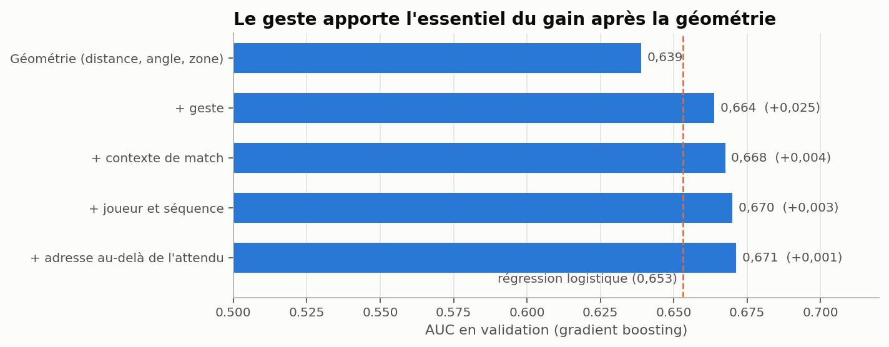

La position du tir donne 0,639. Le **geste** apporte le plus gros gain (+0,025). Le contexte du match et le joueur n'ajoutent que quelques millièmes. C'est la **nature du tir** qui décide de sa réussite, bien plus que le contexte.

### 3.4 Sélection de features : lesquelles servent vraiment ?

J'ai mesuré l'utilité de chacune des 32 features avec l'**importance par permutation** : je mélange au hasard une feature à la fois dans le jeu de validation, et je regarde de combien la note du modèle baisse. Plus elle baisse, plus le modèle avait besoin de cette information.

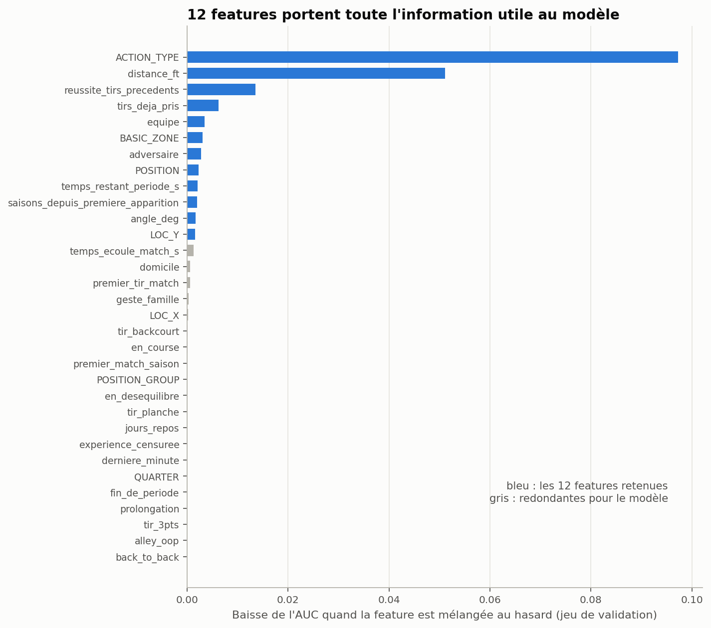

J'ai ensuite réentraîné le modèle avec seulement les features les plus utiles :

| Features utilisées | Note (AUC) | Écart avec les 32 |
|---|---|---|
| Les 32 | 0,671 | |
| **Les 12 plus utiles** | **0,670** | −0,001 |
| Les 6 plus utiles | 0,664 | −0,006 |
| Seulement 2 (geste et distance) | 0,663 | −0,008 |

**Lecture.**

- **12 features suffisent** : retirer les 20 autres ne change rien à la note. Le modèle final utilisera ces 12 (`FEATURES_RETENUES` dans `preprocessing/model_features.py`), ce qui le rend plus simple, plus rapide et plus facile à expliquer.
- **Le geste et la distance font presque tout** : à elles deux, elles donnent 99 % du résultat. Ce qui décide si un tir rentre, c'est d'abord **quel tir** et **d'où**.
- **La réussite du joueur sur ses 3 derniers tirs est la 3e feature**, alors qu'elle ne montre aucun effet « main chaude » quand je la regarde seule (§2.3). Mon interprétation : combinée au geste, elle indique au modèle **le niveau du tireur dans ce match**. C'est une façon indirecte de capter le talent du joueur, qui est justement ce qui manque pour l'objectif 2 (§3.5).
- **Les 20 features écartées ne sont pas fausses, elles sont redondantes** : leur information est déjà dans une autre. `tir_3pts` se déduit de la distance, `fin_de_periode` et `derniere_minute` du temps restant, `geste_famille`, `alley_oop` ou `en_course` du libellé détaillé `ACTION_TYPE`.

**Je les garde quand même dans le dataset**, pour deux raisons. Elles correspondent aux **situations de jeu** que le sujet demande d'analyser : les résultats du §2.3 (−18,7 points au buzzer, +0,8 point à domicile) en viennent. Et elles rendent le modèle plus lisible au moment de l'expliquer (« un dunk » plutôt qu'un des 52 libellés NBA).

**Une réserve.** Ce classement vaut pour le gradient boosting, qui sait déduire seul qu'un tir lointain est un tir à 3 points. Un modèle plus simple, comme la régression logistique, peut avoir besoin de certaines des features écartées.

### 3.5 Le point à travailler : la probabilité de chaque joueur

L'objectif 2 demande la probabilité que **chaque joueur** marque. J'ai donc comparé, pour les 11 joueurs, la réussite prédite à la réussite réelle.

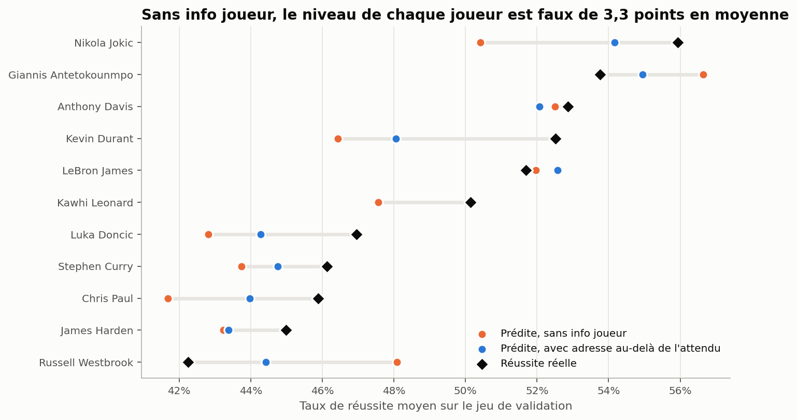

**Constat.** Sans information sur le joueur (points orange), le modèle se trompe de **3,3 points** en moyenne sur son niveau. Il prédit 50,4 % pour Jokić, qui réussit 55,9 % de ses tirs, et surestime Westbrook de 5,8 points. Le modèle regarde le tir, pas le talent du tireur : il donne à Jokić la réussite d'un joueur moyen qui prendrait les mêmes tirs.

**Une piste testée** (points bleus) : ajouter l'**adresse du joueur au-delà de l'attendu**, c'est-à-dire combien il marque de plus (ou de moins) que ce que le modèle prévoyait pour ses tirs. Je la calcule sans fuite : pour chaque tir, uniquement à partir des autres matchs. L'erreur moyenne passe de 3,3 à **1,7 point**, et la prédiction devient meilleure pour 10 joueurs sur 11.

---

## 4. Limites

- **Retraités absents.** La fenêtre et la règle « encore actif » écartent les retraités du classement ESPN. Pour les comparer, il faudrait revenir aux saisons avant 2015-16, avec la limite des coordonnées décrite au §1.1.
- **Familles de gestes.** Quelques libellés sont ambigus : « Driving Bank shot » est rangé en tir simple. L'impact est faible (environ 0,2 % des tirs), et le libellé détaillé reste disponible.
- **Ce qui manque aux données :** le défenseur, le contact, la qualité de la passe, l'horloge des 24 secondes et l'écart au score. C'est ce qui plafonne les modèles autour de 0,70.

## 5. Suite

1. **Trois modèles complémentaires**, à partir de ce dataset :
   - *Tirs anonymes* : le modèle du §3, sans information sur le joueur. Il mesure la difficulté de chaque tir.
   - *Adresse au-delà de l'attendu* : l'écart entre la réussite réelle d'un joueur et celle prévue par le modèle anonyme (§3.5), à calculer saison par saison, et à partir des saisons précédentes uniquement pour éviter toute fuite.
   - *Meilleurs joueurs* : le modèle complet, présenté sur les 11 joueurs.
2. **Régler les modèles** sur les 12 features retenues : tout nouveau modèle devra battre 0,653 et 0,670.
3. **Expliquer les prédictions** avec SHAP, en s'appuyant sur les modificateurs de geste.

## Lexique

| Terme | Définition |
|---|---|
| **Feature** | Une variable donnée au modèle pour qu'il prédise le résultat (la distance du tir, par exemple) |
| **Cible** | Ce que je cherche à prédire : 1 si le tir est réussi, 0 s'il est raté |
| **Dataset** | Le tableau de données final, une ligne par tir |
| **Preprocessing** | Tout ce qui transforme les données brutes en dataset propre : nettoyage, corrections, construction des features |
| **Parquet** | Un format de fichier compact et rapide pour les gros tableaux, à la place du CSV |
| **Fuite de données** | Une information sur le résultat glissée par erreur dans les features : le modèle « triche » |
| **Apprentissage / validation / test** | Les trois groupes de tirs : le modèle apprend sur le premier, je compare les réglages sur le deuxième, et je mesure le résultat final sur le troisième, que le modèle n'a jamais vu |
| **Imputation** | Remplir une case vide avec une valeur raisonnable (ici, le dernier poste connu du joueur) |
| **Doublon** | Deux lignes identiques dans le fichier |
| **Modèle** | Un programme qui apprend, à partir d'exemples, à prédire la cible |
| **Régression logistique** | Un modèle simple qui additionne un poids par feature pour obtenir une probabilité |
| **Arbre de décision** | Une suite de questions oui / non (« distance < 4 pieds ? ») qui mène à une prédiction |
| **Gradient boosting** | Un modèle qui combine des centaines de petits arbres de décision, chacun corrigeant les erreurs du précédent |
| **Importance par permutation** | La mesure de l'utilité d'une feature : je la mélange au hasard et je regarde de combien la note du modèle baisse |
| **Sélection de features** | Ne garder que les features utiles au modèle, pour le simplifier sans perdre en qualité |
| **Feature redondante** | Une feature dont l'information est déjà contenue dans une autre |
| **Réglage (hyperparamètres)** | Les paramètres choisis avant l'entraînement (nombre d'arbres, profondeur...). Pas encore faits. |
| **AUC** (*Area Under the Curve*, aire sous la courbe ROC) | Une note de 0,5 (hasard) à 1 (parfait) : la proportion de paires « un tir réussi, un tir raté » où le modèle donne la probabilité la plus haute au tir réussi |
| **p-value (p)** | La probabilité d'observer un écart aussi grand s'il n'y avait aucun effet. Très petite (p < 0,05), elle signifie que l'écart n'est pas dû au hasard. |
| **IC 95 %** (intervalle de confiance) | La marge d'erreur d'un chiffre : « −18,7 pt ± 0,4 » signifie entre −19,1 et −18,3 |
| **Test de deux proportions (z)** | Le test qui vérifie si deux taux de réussite sont vraiment différents |
| **Test du χ² (khi-deux)** | Le test qui vérifie si deux variables catégorielles (ici le geste et le résultat) sont liées |
| **V de Cramér** | La force du lien mesuré par le χ², de 0 (aucun lien) à 1 (lien total) |
| **Corrélation** (point-bisériale, Spearman) | La force du lien entre deux variables, de −1 à 1. −0,22 entre distance et réussite : plus le tir est lointain, moins il réussit. |

## Reproduire

Depuis la racine du dépôt, conteneur Docker lancé (`docker compose up -d`) :

```bash
docker compose exec -w /app/test/paul jupyter python -m preprocessing.pipeline          # dataset, moins d'une minute
docker compose exec -w /app/test/paul jupyter python -m preprocessing.validate          # validation indépendante
docker compose exec -w /app/test/paul jupyter python -m preprocessing.check_leakage     # contrôle de fuite
docker compose exec -w /app/test/paul jupyter python -m preprocessing.baseline_preview  # premiers modèles
docker compose exec -w /app/test/paul jupyter python -m preprocessing.feature_selection # sélection de features
docker compose exec -w /app/test/paul jupyter python -m preprocessing.figures           # figures de ce rapport
```

Prérequis : les CSV saisonniers décompressés dans `data/raw/shots_csv/` à la racine du dépôt (voir README).
